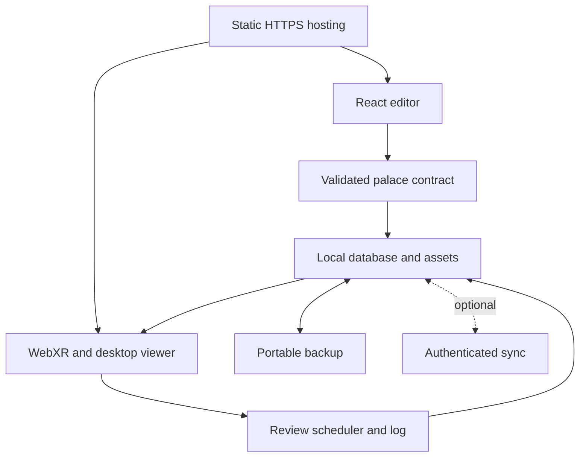

# Loci — a free VR memory palace for Meta Quest 3

Prepared for Andrea · Research checked 16 September 2026 · Design and build specification, not an implemented or headset-tested application.

## Recommendation

Build a static, browser-based application with **React, TypeScript, Vite, Three.js, React Three Fiber and React Three XR**. Host it on **Cloudflare Workers Static Assets, on the Free plan, without a server Worker in the first release**. Save personal content in IndexedDB. Add Supabase only when automatic computer-to-Quest synchronization is worth the added setup.

This is a recommendation for this particular product: a substantial learning-content editor connected to an immersive viewer. It also fits your React/Angular and backend experience. A Spring Boot service, a container, a GPU server and a native Quest application are unnecessary for the initial product.

### What “free” means

| Part | Free baseline | Boundary |
| --- | --- | --- |
| Application code | Open-source browser libraries | Review licenses for any added asset or dependency. |
| Website hosting | Cloudflare Free, static assets, provider subdomain | Plan terms can change; dynamic services have separate limits. |
| Personal storage | IndexedDB on each device | Browser clearing/eviction can lose data; export backups. |
| Content conversion | Manual builder plus copy/paste AI assistance | Arbitrary intelligent conversion is not provided by a static host. |
| Images and models | Procedural objects and your own local images | Do not depend on a paid generation API. |
| Claude | Free chat for planning, code proposals and reviewing pasted diffs | Claude Code is not included in the Free plan. |
| Codex | Current ChatGPT Free access, or your existing eligible plan | Usage limits apply; existing subscriptions are not “free.” |
| Automatic sync | Optional Supabase Free | Storage/egress limits and inactivity pausing apply. |

Claude lists Claude Code under paid plans, while free chat can generate code. OpenAI currently lists Codex access on ChatGPT Free and other eligible plans. Neither statement means unlimited work or free production API calls. Use account-included access, avoid optional paid usage, and recheck availability before starting. Sources: [Claude pricing](https://claude.com/pricing), [Codex pricing](https://learn.chatgpt.com/docs/pricing).

## Hosting decision

| Host | Relevant free offering | Main limitation | Verdict |
| --- | --- | --- | --- |
| Cloudflare Workers Static Assets | Static asset requests are free and unlimited; asset storage has no additional charge | Free deployments: 20,000 files; each asset at most 25 MiB. Executing Worker code has separate quotas. | **First choice for a new static app.** |
| Cloudflare Pages | Free static requests; 500 builds/month | 20,000 files and 25 MiB per asset on Free | Equally workable if you prefer its Git-to-static-site workflow. |
| Vercel Hobby | Free deployment for personal, noncommercial use; 100 GB Fast Data Transfer included | Personal/noncommercial restriction and usage caps | Good alternative for this personal project. |
| Render Static Sites | Free CDN-hosted static deployment | Shares bandwidth and build-minute allowances | Viable. Choose “Static Site.” |
| Render Free Web Service | A running backend within its free allowance | Sleeps after 15 minutes idle, roughly one-minute wake-up; ephemeral files. Free Postgres expires after 30 days. | Unnecessary for this architecture. |

Sources: [Cloudflare asset billing](https://developers.cloudflare.com/workers/static-assets/billing-and-limitations/), [Workers limits](https://developers.cloudflare.com/workers/platform/limits/), [Pages limits](https://developers.cloudflare.com/pages/platform/limits/), [Pages static pricing](https://developers.cloudflare.com/pages/functions/pricing/), [Vercel Hobby](https://vercel.com/docs/plans/hobby), [Render free services](https://render.com/docs/free), [Render static sites](https://render.com/docs/static-sites).

The hosting provider serves the application files. **The Quest renders the 3D world locally.** Hosting on a free tier does not impose a server GPU requirement. Personal imports must stay outside the deployed public asset directory.

Use a free `workers.dev`, `pages.dev`, `vercel.app` or `onrender.com` address. Purchasing a custom domain is optional. Do not enable paid hosting plans or add a billing-dependent product to meet the initial acceptance criteria.

## Stack and alternatives

| Layer | Choice | Reason |
| --- | --- | --- |
| Editor and navigation | React + TypeScript + Vite | Forms, import previews and a fast static build; no SSR requirement. |
| Rendering | Three.js + `@react-three/fiber` | React components for reusable rooms and mnemonic objects. |
| Immersive input | `@react-three/xr` | WebXR sessions, controller/hand interactions and locomotion helpers. |
| Scene helpers | Selective `@react-three/drei` | Text and asset helpers; avoid importing expensive effects by default. |
| Spatial controls | `@react-three/uikit` if needed | Controls rendered within the immersive scene. A DOM overlay is not the VR interface. |
| Local persistence | IndexedDB through Dexie | Transactions, structured content and image/audio blobs. |
| Validation | Zod + the supplied JSON Schema contract | Untrusted AI or imported content must pass validation before use. |
| Transient UI state | React state; Zustand where shared state warrants it | Keep the persistent database authoritative; avoid duplicate content stores. |
| Scheduling | `ts-fsrs`, behind a small adapter | Review scheduling independent of the scene renderer. |
| Portable export | JSON first; `fflate` archive with manifest + blobs later | A complete backup must include media bytes, not temporary blob URLs. |
| Verification | Vitest + Testing Library + Playwright; IWER in development | Unit/integration checks and browser checks, followed by real Quest testing. |
| Offline application shell | `vite-plugin-pwa`, after the initial XR milestone | Controlled cache updates, locally available rooms and assets. |

Pin compatible releases when implementing and commit the lockfile. React 19 should use the compatible React Three Fiber 9 family; verify actual peer dependencies for XR, Drei and UIKit. Do not blindly combine every package's newest version or use `--force` / `--legacy-peer-deps` to hide a mismatch. The supplied package list is a design choice, not a claimed install-tested lockfile. Sources: [R3F compatibility guide](https://r3f.docs.pmnd.rs/tutorials/v9-migration-guide), [R3F package manifest](https://github.com/pmndrs/react-three-fiber/blob/master/packages/fiber/package.json), [React Three XR](https://pmndrs.github.io/xr/docs/getting-started/introduction), [Dexie](https://dexie.org/docs), [ts-fsrs](https://github.com/open-spaced-repetition/ts-fsrs).

| Alternative | When it would be preferable | Decision here |
| --- | --- | --- |
| Meta Immersive Web SDK | An immersive-first product with its ECS, scene tooling, built-in locomotion and spatial UI | Strong second choice. Meta currently recommends this path. Our React-heavy authoring UI makes R3F a reasonable fit; keep the data contract renderer-independent. |
| A-Frame | A quick, mostly declarative VR demonstration | Useful for a prototype; less natural for this React editor. |
| Babylon.js | A project that wants a more complete game-engine-style runtime | Capable alternative; switching offers little clear advantage for the initial features. |
| Native Unity/Godot | A later product needing native platform integration | Changes the website requirement and deployment workflow. |
| Next.js | A later app needing server rendering or substantial server functionality | Adds little value to the initial static viewer/editor. |

These are product-fit judgments, not benchmark results. Sources: [Meta's current WebXR guidance](https://developers.meta.com/horizon/documentation/web/webxr-overview/), [IWSDK capabilities](https://developers.meta.com/horizon/documentation/iwsdk/guides/overview/), [Meta's React WebXR example](https://github.com/meta-quest/webxr-first-steps-react), [A-Frame](https://aframe.io/docs/1.7.0/introduction/), [Babylon.js](https://www.babylonjs.com/specifications/).

## Product design

The core loop is: **prepare a small fact → create a mnemonic → place it at a stable location → rehearse the route → recall before revealing → schedule the next review**.

### Screens

| Screen | Main content | Primary action |
| --- | --- | --- |
| My palaces | Palaces, last visit and items due; visible local/synced state | Create palace / Continue learning |
| Add material | Pasted text, Markdown or a simple CSV; original text beside proposed items | Review extracted items |
| Mnemonic studio | Exact answer, cue, meaning scene, optional number anchor, ordered sound hooks and source | Approve mnemonic |
| Palace editor | Ordered rooms/loci on the left, 3D preview in the center, selected item's details on the right | Place at selected locus |
| Enter palace | Capability check, seated/standing choice, controller help and asset-loading state | Enter VR / Open desktop view |
| Immersive rehearsal | Stable room, clear landmarks, one focused mnemonic, spatial controls | Recall / Reveal / Rate |
| Review results | What was reviewed, difficult items and next due dates | Finish / Revisit difficult items |
| Settings and backup | Hook dictionary, themes, import/export, storage use and optional sync | Export backup |

On a phone, collapse the editor into sequential steps and a selected-item drawer. Avoid drag-only placement: every placement can also be made with “Choose room” and “Choose location” controls. On Quest, do substantial text editing before entering VR.

### Visual direction

Use a quiet architectural palace: warm stone, ink-blue shadows and a small teal accent for navigation. Give rooms distinct silhouettes and landmarks. Mnemonic scenes can be much more vivid than the environment. Your cyberpunk/ukiyo-e mnemonic images fit as large plaques, cutouts or small stage scenes. Keep navigation and text clean and high-contrast.

The first release uses authored geometry, a few procedural props and optional imported images. It does not promise fully generated 3D characters or photorealistic worlds from arbitrary notes. A vivid 2D image placed in a real 3D room is a useful, inexpensive first representation.

### Personal mnemonic profile

Make these settings an editable local profile, with an explicit import choice. Do not bake personal content into a public demo.

* **Three layers:** dominant number peg when one is assigned; one coherent scene communicating meaning; a left-to-right pronunciation chain.
* **Persistent hook dictionary:** retain mappings such as あ → ape (bee), か → carota, し → sci, な → nacchere, ね → neve and も → Moka. Treat these as your mnemonic approximations, not linguistic equivalences.
* **Exact learning fields:** Japanese original, kana, Hepburn romaji, optional Italian pronunciation approximation, Italian/English meaning and notes. For French, permit IPA and Italian sound approximations. Never silently alter the original answer.
* **Style profile:** strong silhouettes, large memorable actors, one clear action and restrained background detail. Imported artwork and 3D UI labels remain separate.
* **Your earlier eight-room route as an optional template:** External Lobby → Entrance → Living room → Kitchen → Balcony → My bedroom → Shoes lobby → Couple's bedroom. This is a semantic sequence, not a measured reconstruction of your home. Create loci deliberately within it; do not infer real dimensions or furniture positions.

Never relocate existing items because a new item was inserted, a list was sorted, or a review became due. A review queue changes visit order; it does not change the palace.

## Converting learning material without a paid API

There are two honest baseline modes:

1. **Manual conversion:** split text into candidate cards using simple delimiters, keep the source, let the user approve a single learning objective, then choose an object/image and location. Label this as a builder; do not claim semantic AI understanding.
2. **AI-assisted file bridge:** the app exports selected material, the allowed asset catalogue, the user's selected hooks and a generation prompt. The user pastes these into Claude or ChatGPT. The assistant returns JSON. The app validates it, shows a review preview, and imports approved items transactionally.

The bridge transmits nothing automatically. It gives useful assistance within whatever free or existing chat allowance the user has. Claude and Codex are development tools here; the running website does not require either to be available.

The conversion stages are: source capture → candidate atomic facts → user correction → mnemonic suggestion → asset/scene recipe → schema and semantic validation → explicit placement → rehearsal. Facts and metaphors must be separate fields, and incomplete source information must produce questions or clearly marked drafts, not invented facts.

Later inputs may include local PDF text extraction, CSV/Anki-style import and user-recorded audio. OCR, general video understanding, paid text-to-image/text-to-3D services, autonomous tutoring and live speech recognition are outside the first release. Browser text-to-speech is optional, feature-detected and never the only way to access an answer.

## Architecture and data

Keep four boundaries: learning content; mnemonic/scene description; rendering and interactions; persistence/scheduling. The domain layer must not import React or Three.js. Renderer nodes are created from known asset IDs and allowed actions. Imported text is always data, never HTML, JSX, JavaScript, a shader or a shell command.

### Main records

| Record | Essential fields | Invariant |
| --- | --- | --- |
| Palace | ID, name, schema version, ordered rooms | A saved route does not regenerate on each visit. |
| Room | ID, stable template, ordered loci | World coordinates have meters as their unit. |
| Locus | ID, room ID, label, position, facing | IDs survive reordering; one active learning item per locus in v1. |
| Learning item | ID, cue, exact answer, source excerpt, mnemonic | Preserve source and answer separately from the metaphor. |
| Mnemonic | Meaning/action, optional peg, ordered hooks, render nodes | A small visible scene; the full chain can be rehearsed in chunks. |
| Asset | ID, type, local blob/hash or bundled catalogue entry, license | Private assets are not deployed public files. |
| Review | Event ID, item ID, UTC time, rating, scheduler version | Same event cannot be applied twice. |
| Scheduled card | Item ID, due date, serialized scheduler state | Scheduling cannot move the item in space. |
| Hook dictionary | Language/sound key, user-approved hook, description | An AI suggestion cannot replace a saved hook silently. |

`schemas/palace.schema.json` defines a deliberately small **v1 content interchange format**; `examples/palace-example.json` is a matching content fixture. Review history, media and sync metadata belong in a later full backup envelope, not in this content-only schema. The app must visibly distinguish **Import content** from **Restore complete backup**.

Schema validation is only the first check. Validate uniqueness of IDs, referenced rooms/loci, one item per locus, known asset IDs, valid hook/node references, complete room membership, allowed transforms, and bounded allocation. Initial importer limits: 2 MiB content JSON, 200 items, 500 loci, 20 rooms, 32 hooks/item and 34 stored node recipes/item. Display at most eight mnemonic nodes at once: up to two persistent meaning/peg nodes plus up to six sound nodes in the selected chunk. Nodes not referenced by pronunciation hooks are the persistent scene nodes; allow at most two. Store the complete chain, but instantiate only its active chunk. These are product defaults, not hardware limits.

Coordinate convention: right-handed, +Y up, with meters as units. A room's `origin` and `yawDegrees` are world-space transforms. A locus's `position` and `yawDegrees` are relative to its room. Node positions are relative to the locus; compose world = room transform × locus transform × node transform. Positive yaw follows Three.js rotation about +Y. A neutral viewer faces -Z. Persist room origins as well as locus transforms; room-order edits change the visit sequence, not geometry positions. The supplied fixture belongs to M1; use separate synthetic one-room/three-prop data for M0.

A failed import must leave the current database unchanged. Import into a staging model; show changes; then commit in one transaction. Import-as-copy remaps every related ID. Re-importing content must not overwrite review progress without an explicit restore operation. Maintain schema migrations and a recovery export before a destructive migration.

Store blobs in IndexedDB rather than localStorage. Use `navigator.storage.estimate()` and request persistence when supported, handling denial and quota errors. Browser storage is per origin and per device; a preview deployment or another hostname sees a different database. Backups remain necessary. Source: [Browser storage and eviction](https://developer.mozilla.org/en-US/docs/Web/API/Storage_API/Storage_quotas_and_eviction_criteria).

### Cross-device use

**First release:** export a content JSON on the computer and import it through a file picker in Quest Browser before entering VR. Test the actual Quest file workflow. A desktop export button alone does not establish that handoff works. Full backups later include media bytes and review state. Do not put personal content in query strings or publicly publish it as a shortcut.

**Optional convenient mode:** Supabase Auth + Postgres + private Storage buckets. Use an appropriate browser OAuth sign-in flow, for example Google with correctly configured redirect URLs, so public rollout does not depend on a demonstration email sender. Limit provider credentials to its configuration screen; only the intended publishable browser key belongs in the client. Every content table and storage policy must restrict access to the authenticated owner. Never expose a service-role key. Test two different users against both database rows and media access. Source: [Supabase RLS](https://supabase.com/docs/guides/database/postgres/row-level-security).

Keep Dexie usable offline; write changes to an outbox with stable operation IDs. Use server-checked revisions for content edits, preserve conflicting versions for the user, and deduplicate append-only review events. Serialize reviews per item on reconciliation and recompute scheduling in timestamp/event-ID order. A paused or unavailable backend must leave local study usable. Supabase Free currently includes a 500 MB database, 1 GB file storage and 5 GB egress, and can pause after one week of inactivity. Source: [Supabase plans](https://supabase.com/pricing).

## Quest 3 interaction and performance

Open the deployed **HTTPS** URL in Meta Quest Browser, then select **Enter VR**. Normal use does not require an APK, PC streaming or an app-store release. Detect `navigator.xr` and `isSessionSupported('immersive-vr')`; handle rejections. The immersive request must follow a user action. Developer tooling may require separate device setup; normal browsing does not. Sources: [Meta WebXR](https://developers.meta.com/horizon/documentation/web/webxr-overview/), [Meta device testing](https://developers.meta.com/horizon/documentation/iwsdk/guides/02-testing-experience/), [WebXR secure context](https://developer.mozilla.org/en-US/docs/Web/API/WebXR_Device_API).

* **Controllers first:** ray selection, obvious hover/selection feedback, teleport pads and 30-degree snap turn. Verify actual input mappings with the installed XR version and Quest controllers. Hand tracking is a later optional enhancement with a controller fallback.
* **Comfort:** seated and standing modes; recenter action; stable horizon; no head bob, forced camera motion or continuous locomotion by default. Turn/move the XR origin, not the headset pose managed by WebXR. Brief transitions must respect reduced-motion preferences.
* **Spatial UI:** large, world-space panels at a comfortable adjustable distance; start around 1.5–2 meters and test. Do not rely on HTML/CSS editor controls being visible in immersive VR. Source: [React XR overlay guidance](https://pmndrs.github.io/xr/docs/tutorials/dom-overlay).
* **Learning interaction:** inspect cue → attempt recall → optionally ask for a mnemonic hint → reveal exact answer → choose Again / Hard / Good / Easy. Support a separate route rehearsal mode where every mnemonic is visible. A strict recall mode hides the mnemonic until a hint is requested.
* **Scene budgets:** initial targets, not Quest hardware specifications: active room plus required transition geometry; under roughly 100 draw calls and 150,000 visible triangles; most images at 1024px, rare 2048px; no real-time shadows or postprocessing in the baseline. Profile and revise these targets based on measured bottlenecks.
* **Timing:** begin with a 72 Hz target where supported (13.9 ms/frame), make 90 Hz an improvement target (11.1 ms/frame), query supported frame rates, and measure delivered cadence. A desktop frame counter or emulator is not proof of headset performance. Minimize missed frames at the actual session refresh rate.
* **Loading:** lazy-load XR code, load the selected palace's necessary assets before entering VR, dispose unused textures/geometries, use instancing when appropriate, and keep React state updates out of the per-frame hot path.
* **Lifecycle:** handle session end/re-entry, page visibility, controller disconnects, WebGL context loss and interrupted asset loads. Cache updates must not reload the page in the middle of an immersive session.

Use development emulation for iteration, then test the deployed top-level URL on the physical headset. Avoid promising WebXR in an arbitrary embedded preview frame. Source: [Meta performance workflow](https://developers.meta.com/horizon/documentation/web/webxr-perf/).

## Build order and acceptance gates

| Milestone | Deliverable | Evidence needed |
| --- | --- | --- |
| M0 — XR viability | Static app; one room; three selectable props; enter/exit VR; controller selection; teleport; snap turn; desktop fallback | Build succeeds; HTTPS preview works; Andrea verifies the controls and readable text on Quest 3. Record hardware testing as pending until it happens. |
| M1 — End-to-end learning slice | Three rooms, eight stable loci; validated content import; placement; reload persistence; cue/reveal/rating; JSON content export | Import→place→reload→visit→rate→export→reimport preserves content, placement and intended data boundaries. Invalid imports are atomic. |
| M2 — Useful daily study | Editable hook dictionary, FSRS scheduler, image import, media-inclusive backup, offline cache | Export/restore reproduces media and scheduling; import content does not destroy reviews; cached selected palace works offline after a prior successful load. |
| M3 — Convenient device handoff | Optional Supabase sync or verified file handoff sufficient for daily use | The same item edited on a computer appears on Quest; two-user isolation if sync enabled; offline conflict handling verified. |
| M4 — Expansion | Local PDF extraction, richer props, hand tracking, additional palace templates | Each addition preserves comfort, the saved route, cost constraints and data compatibility. |

Do M0 before building a complex editor. Do not spend a week building content import and only then discover that entering VR or spatial text is broken. The useful first complete product is M0–M2, with a verified way to get content onto Quest. M3 is optional if manual transfer is acceptable.

The first version excludes multiplayer, physics-heavy scenes, user-authored executable scripts, generated 3D worlds, native packaging and paid AI inference. These are scope choices, not permanent prohibitions.

## Development workflow with Claude and Codex

Use one repository and one shared brief. `AGENTS.md` is the core instruction file. `CLAUDE.md` imports it. Claude Code supports this explicit import, whereas plain Claude chat needs the files attached or pasted. Sources: [Codex instructions](https://learn.chatgpt.com/docs/agent-configuration/agents-md), [Claude project memory](https://code.claude.com/docs/en/memory).

For the strictly free workflow, use **Claude chat as designer/reviewer** and **Codex as implementer**. Give Claude the blueprint and the current diff; give Codex Claude's actionable review plus the same canonical files. If you already have Claude Code access, either tool can implement a bounded task.

Start sequentially: Claude reviews the M0 approach → Codex implements M0 → Claude reviews the diff → Codex fixes findings → you test on Quest. This is a coordination choice, not a claim that either model is inherently better at those jobs.

If you later run both simultaneously, use separate branches/worktrees and disjoint file ownership. One active owner edits shared schemas, migrations, package manifests and the lockfile. A task ledger and handoff record identify the base revision, changed paths, checks actually run, unresolved findings and next task. An agent must inspect the current diff before trusting a handoff or changing another agent's work.

### Skills and rules

The reusable **Mindpalace Builder** guidance has three workflows: implement a comfortable XR slice, convert learning material into validated mnemonic data, and verify imports/reviews/hosting. Keep these workflows short and load relevant references when needed.

Project-scoped skills can use `.agents/skills/<name>/SKILL.md` for Codex and `.claude/skills/<name>/SKILL.md` for Claude Code. These discovery locations are different. Do not assume installing a skill in one product installs it in the other. The repository's common instructions and `docs/WORKFLOWS.md` also work without skill installation. Sources: [Codex skills](https://learn.chatgpt.com/docs/build-skills), [Claude skills](https://code.claude.com/docs/en/skills).

No MCP server or paid plugin is required for the baseline. Use repository access, official documentation, browser testing and the device. Add an integration only for a concrete task that needs it.

## Deployment recipe

After the application has been built, validated and authorized for publishing:

1. Install the compatible dependencies and commit a reproducible lockfile. Set the same supported Node version locally and in the build environment.
2. Run typechecking, focused tests and `npm run build`. Vite outputs `dist/`.
3. Use the included `wrangler.jsonc`: `assets.directory` is `./dist`; SPA fallback is enabled; no `main` Worker script is configured.
4. Authenticate with Cloudflare through its normal login flow. Use a local pinned Wrangler dependency. Deploy with `npx wrangler deploy`, or connect the repository with build command `npm run build` and deploy command `npx wrangler deploy`.
5. Open the resulting HTTPS `workers.dev` address directly. Test deep links, asset paths and Quest entry. Confirm that no private fixtures, exports or user media were included in `dist/`.
6. Keep one stable production origin for personal browser data. Offer a backup before a hostname change. Use preview origins for testing rather than as the only copy of a palace.

For Pages use build command `npm run build`, output `dist`, and a verified SPA fallback. For Vercel choose Vite and `dist`; configure client-route rewrites. For Render choose Static Site, publish `dist`, and add a rewrite from client routes to `index.html`.

Sources: [Workers SPA configuration](https://developers.cloudflare.com/workers/static-assets/routing/single-page-application/), [Wrangler configuration](https://developers.cloudflare.com/workers/wrangler/configuration/), [Vite setup](https://vite.dev/guide/).

## Definition of done

The first release is done when Andrea can prepare a learning item, preserve its exact answer, place a memorable scene at a stable locus, get it onto Quest, enter immersive VR, recall/reveal/rate it, revisit it later, and export a usable backup without a paid runtime dependency. Automated checks support this conclusion; physical Quest testing establishes the device-specific part. No implementation or headset results are claimed by this design pack.
